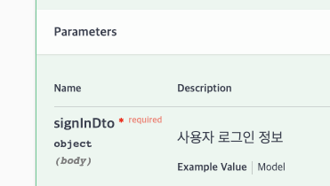

# 스웨거

---


- `@ApiOperation`: api의 이름과 설명을 기재
    
    ```java
    @ApiOperation(
        value = "로그인",
        notes = "로그인을 시도 로그인 성공 시 \n" +
            "accessToken은 Authorization헤더에 refreshToken을 식별할 수 있는 uuid는 refresh쿠키에 저장하여 응답한다.\n" +
            "쿠키의 경우 httpOnly로 브라우저에서 접근할 수 없다.\n" +
            "이미 로그인된 경우 409 Error를 반환한다.\n" +
            "requestBody에 pushOut을 true로 넘길 경우 기존 로그인을 종료 시키고 새로 로그인한다."
    )
    @PostMapping("/sign-in")
    public ResponseEntity<?> signIn(
        HttpServletResponse httpServletResponse,
        @Valid @RequestBody SignInDto signInDto
    ) {
    
        TokenDto tokenDto = authService.signIn(signInDto);
    
        httpServletResponse.addHeader(TokenProvider.AUTHORIZATION_HEADER_NAME,  TokenProvider.TOKEN_PREFIX + tokenDto.getTokenPair().getAccessToken());
    
        return ResponseEntity.ok()
            .headers(tokenDto.getHttpHeaders())
            .body("success");
    }
    ```

    
    

- `@ApiModelProperty`: 응답 객체필드에 대한 명세를 기재
    - name: 속성의 이름을 재정의 할 수 있게 함
    - example: 속성 값에 대한 예시를 보여줌
    - notes: 속성 값에 대한 설명을 기재
    - required: 필수 여부
    - hidden: 필드를 스웨거 문서에서 숨김처리
    
    ```java
    @Getter
    @Setter
    @Builder
    @NoArgsConstructor
    @AllArgsConstructor
    public class SignInDto {
    
        @ApiModelProperty(
            name = "사용자 아이디",
            example = "example@example.com",
            notes = "사용자의 아이디며 이메일 형식을 가진다."
        )
        @NotBlank
        private String userId;
        
        @NotBlank
        private String userPassword;
    
        private Boolean pushOut;
    }
    ```

    


- `@ApiImplicitParam` : api의 파라메터에 대한 명세를 기재
    
    `@ApiImplicitParams`로 하나 이상의 파라메터에 대한 정보 기재 가능
    
    `dataType`, `paramType`, `required`의 경우 해당 `name`의 정보가 자동으로 채워지므로 생략 가능
    
    - name: 파라메터의 변수 명
    - value: 표시될 파라메터의 값(이름)
    - defaultValue: 디폴트 값
    - dataType: 파라메터의 타입
    - dataTypeClass: 파라메터의 클래스 타입, dataType 존재 시 재정의(덮어쓰기) 함
    - paramType: 파라메터의 타입 `path`, `query`, `body`, `header`, `form` 중 하나의 값을 가짐
    - required: 필수 여부
    - format: 사용자 지정 format을 추가
    
    ```java
    @ApiImplicitParam(
        name = "signInDto",
        value = "사용자 로그인 정보",
        dataTypeClass = SignInDto.class
    )
    @PostMapping("/sign-in")
    public ResponseEntity<?> signIn(
        HttpServletResponse httpServletResponse,
        @Valid @RequestBody SignInDto signInDto
    ) {
    
        TokenDto tokenDto = authService.signIn(signInDto);
    
        httpServletResponse.addHeader(TokenProvider.AUTHORIZATION_HEADER_NAME,  TokenProvider.TOKEN_PREFIX + tokenDto.getTokenPair().getAccessToken());
    
        return ResponseEntity.ok()
            .headers(tokenDto.getHttpHeaders())
            .body("success");
    }
    ```

    
    

- `@ApiIgnore` api를 스웨거 문서에서 보이지 않게 함
    - value: 문서에서 배제된 사유를 기재
    
    ```java
    @ApiIgnore(value = "뀨")
    @ApiOperation(
        value = "토큰 리이슈",
        notes = "쿠키의 uuid를 가지고 토큰을 리이슈한다."
    )
    @PostMapping("/token/reissue")
    public String tokenReissue() {
        return null;
    }
    ```
    

- `@ApiResponse` : api의 상태코드값 별 메세지를 설정 가능
    
    `@ApiResponses`로 하나 이상의  상태값에 대한 메세지 설정 가능
    
    - code: 응답 상태코드
    - message: 상태코드에 표시될 메세지
    - response: 메시지의 페이로드를 설명하는 선택적 응답 클래스, 응답 메시지 개체의 'schema' 필드에 해당
    - responseHeaders:
        
        `@ResponseHeader` 
        
        - name: 헤더이름
        - response: 헤더의 데이터 타입
        - description: 설명
        
        ```java
        @ApiResponses({
            @ApiResponse(
                code = 200,
                message = "로그인 성공",
                response = String.class,
                responseHeaders = @ResponseHeader(
                    name = "Authorization",
                    description = "jwt 토큰이 전달됨 ex) Bearer eysg3swg...",
                    response = String.class
                )
            ),
        })
        ```
        
        
    - responseContainer:


> 참조: [https://kim-jong-hyun.tistory.com/49,](https://kim-jong-hyun.tistory.com/49) [https://machine-geon.tistory.com/139](https://machine-geon.tistory.com/139)
