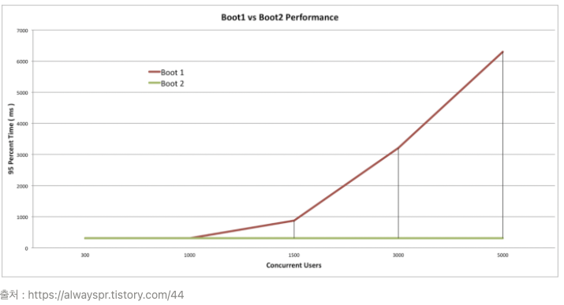

# WebClient란

RestTemplate를 대체하는 HTTP Client이다.

기존의 동기 API를 제공할 뿐만 아니라 논블로킹 및 비동기 접근 방식을 지원해서 효율적인 통신을 제공

`block` 함수를 통하여 블록킹 방식으로 사용이 가능하나 권장되지는 않는다.

WebClient는 요청을 나타내고 전송하게 해주는 빌더 방식의 인터페이스를 사용하며, 외부 API로 요청할 때 리액티브 타입의 전송과 수신을 함(`Mono`, `Flux`) 

# HTTP Client들과 특징

## RestTemplate

 SpringFramework 3.0에서 지원하는 HTTP Client, `Depercated` 될 예정

- 통신을 단순화하고 RESTful 원칙을 지킨다
- 멀티쓰레드 방식을 사용
- Blocking 방식을 사용

## AsyncRestTemplate

 SpringFramework 4.0에서 지원하는 HTTP Client , `Depercated` 됨

- 기존 RestTemplate에 비동기 방식을 추가

## WebClient

SpringFramework 5.0에서 지원하는 HTTP Client 

- 싱글 스레드 방식
- Non-Blocking 방식
- JSON, XML을 쉽게 응답받음

# RestTempalte 과 WebClient

## 비교

### 차이

|  | RestTempalte | WebClient |
| --- | --- | --- |
| Non-Blocking  | 불가 | 가능 |
| 비동기화 | 불가 | 가능 |

### 성능

> 참조: [https://medium.com/@odysseymoon/spring-webclient-사용법-5f92d295edc0](https://medium.com/@odysseymoon/spring-webclient-%EC%82%AC%EC%9A%A9%EB%B2%95-5f92d295edc0)