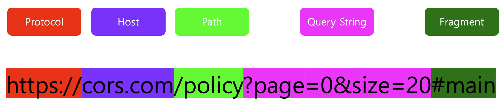
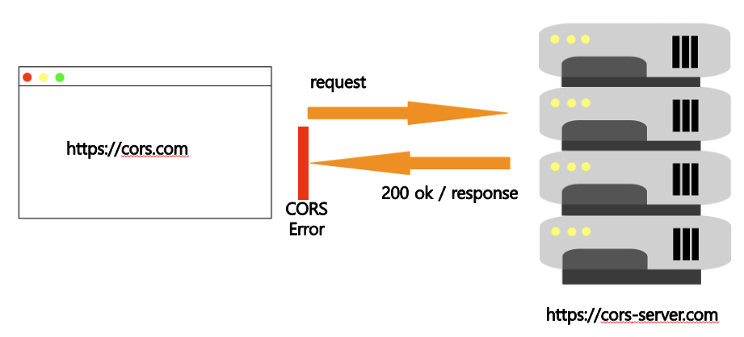
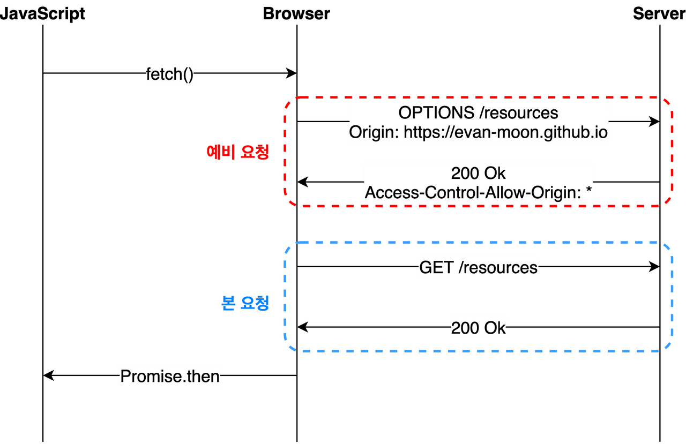
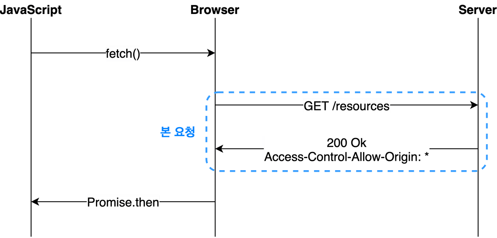

# CORS(교차 출처 리소스 공유)

---




**Origin**: `protocol` + `host` [ +`port`] 를 의미 

# SOP(Same Origin Policy)

- [RFC 6454](https://tools.ietf.org/html/rfc6454#page-5)에서 처음 등장한 보안 정책
- 같은 출처에서만 리소스를 공유 가능
- 웹 환경에서 지키기가 어려움

# CORS(Cross-Origin Resource Sharing)



- 응답 헤더에 유효한 `Access-Control-Allow-Origin` 값의 존재 여부 판단
- 브라우저에 구현되어있는 정책 - 서버가 정상응답하더라도 CORS가 발생할 수 있음

## Preflight Request



- **preflight**: 본 요청을 보내기 전에 먼저 보내는 예비 요청, METHOED: `OPTIONS`
- 예비 요청의 역할은 본 요청을 보내기 전에 브라우저 스스로 이 요청을 보내는 것이 안전한지 확인하는 것
- 예비 요청에서 브라우저는 `Access-Control-Request-Headers`를 사용하여 본 요청에 사용할 헤더를 알려주거나, `Access-Control-Request-Method`를 사용하여 이후 사용할  메소드를 서버에게 미리 알려줌

## Simple Request



- preflight와 전반적인 로직은 같으나 예비 요청의 존재 유무만 다름
- 특정 조건을 모두 만족하는 경우에만 예비 요청을 생략 가능
    - 요청의 메소드는 `GET`, `HEAD`, `POST` 중 하나
    - `Accept`, `Accept-Language`, `Content-Language`, `Content-Type`, `DPR`, `Downlink`, `Save-Data`, `Viewport-Width`, `Width`를 제외한 헤더 사용 불가
    - 만약 `Content-Type`를 사용하는 경우 `application/x-www-form-urlencoded`, `multipart/form-data`, `text/plain`만 허용

## Credentialed Request

- 인증된 요청을 사용하는 방법
- 다른 출처 간 통신에서 보안을 더 강화하고 싶을 때 사용하는 방법
- **credentials**: 요청에 인증과 관련된 정보를 담을 수 있게 해주는 옵션
    - **same-origin(기본값)**: 같은 출처 간 요청에만 인증 정보를 담을 수 있음
    - **include**: 모든 요청에 인증 정보를 담을 수 있음
    - **omit**: 모든 요청에 인증 정보를 담지 않음
- `same-origin` 또는 `include` 적용 시  `Access-Control-Allow-Origin` 에는 `*` 을 사용할 수 없으며, 명시적인 URL이어야 함
- 응답 헤더에는 반드시 `Access-Control-Allow-Credentials: true` 가 존재해야 함

# 해결방안

1. `Access-Control-Allow-Origin`세팅
    - 서버에서 `Access-Control-Allow-Origin` 헤더에 알맞은 값을 세팅
    - 와일드 카드인 `*` 대신 가급적 출처를 명시
2. Webpack Dev Server로 리버스 프록싱

    - 개발환경에서만 적용가능
    - > Keep in mind that `proxy` only has effect in development (with `npm start`)
[https://create-react-app.dev/docs/proxying-api-requests-in-development/](https://create-react-app.dev/docs/proxying-api-requests-in-development/)


```jsx
module.exports = {
	devServer: {
		proxy: {
			'/api': {
				target: 'https://localhost:3000',
				changeOrigin: true,
				pathRewrite: {'^/api': ''},
			}
		}
	}
}
```


> 참조 [https://evan-moon.github.io/2020/05/21/about-cors/](https://evan-moon.github.io/2020/05/21/about-cors/)