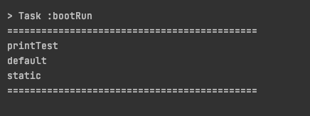

# interface default

---

## java 8에서 interface

기존 자바의 인터페이스에서는 추상 메소드만을 멤버로 가질 수 있었습니다.
하지만 java 8 이후로는 `default`, `static`를 사용할 수 있게 되었습니다.


```java
public interface ITest{
    void printTest();
    default void printDefault(){
        System.out.println("default");
    }
}

public class Main{

  public static void main(String[] args) {
    Test test = new Test();
    System.out.println("============================================");
    test.printTest();
    test.printDefault();
    ITest.printStatic();
    System.out.println("============================================");

  }

  public static class Test implements ITest {
      
    @Override
    public void printTest() {
      System.out.println("printTest");
    }
  }
    
}


```




`default` 키워드로 정의한 메서드는 오버라이드를 하지 않고 사용할 수 있으며 오류 또한 발생하지 않습니다.
물론 아래와 같이 오버라이드하여 직접 세부내용을 구현이 가능합니다.


```java
 public static class Test implements ITest {
    
        @Override
        public void printDefault() {
            System.out.println("override printDefault");
        }

        @Override
        public void printTest() {
            System.out.println("printTest");
        }
    }

```


`static`의 경우 인터페이스를 상속받은 구현체가 아닌 인터페이스를 통해서 접근할 수 있습니다.

 
